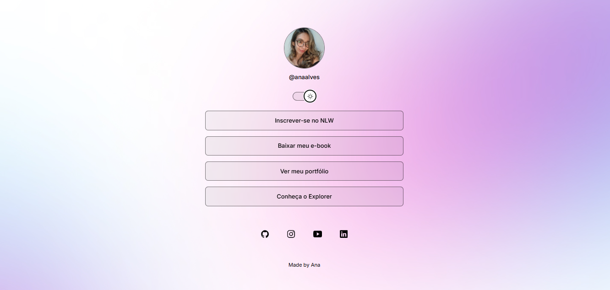

<h1 align="center">DevLinks</h1>

  <a href="#-technologies">Technologies</a>&nbsp;&nbsp;&nbsp;|&nbsp;&nbsp;&nbsp;
  <a href="#-project">Project</a>&nbsp;&nbsp;&nbsp;|&nbsp;&nbsp;&nbsp;
  <a href="#-layout">Layout</a>&nbsp;&nbsp;&nbsp;|&nbsp;&nbsp;&nbsp;
  <a href="#memo-license">License</a>

  

 

  

## 🚀 Technologies

This project was developed using the following technologies:

- HTML & CSS  
- JavaScript  
- Git & GitHub  
- Figma  

## 💻 Project

**DevLinks** is a link aggregator for you to use as an online business card.

  <a href="https://ana-alves-santos.github.io/devlinks/" target="_blank">
    🚀 Access the live project
  </a>

## 🖼️ Layout

The layout was designed on [Figma](https://www.figma.com/).

## :memo: License

This project is under the [MIT License](LICENSE).

---
This project was developed during a Rocketseat course.
